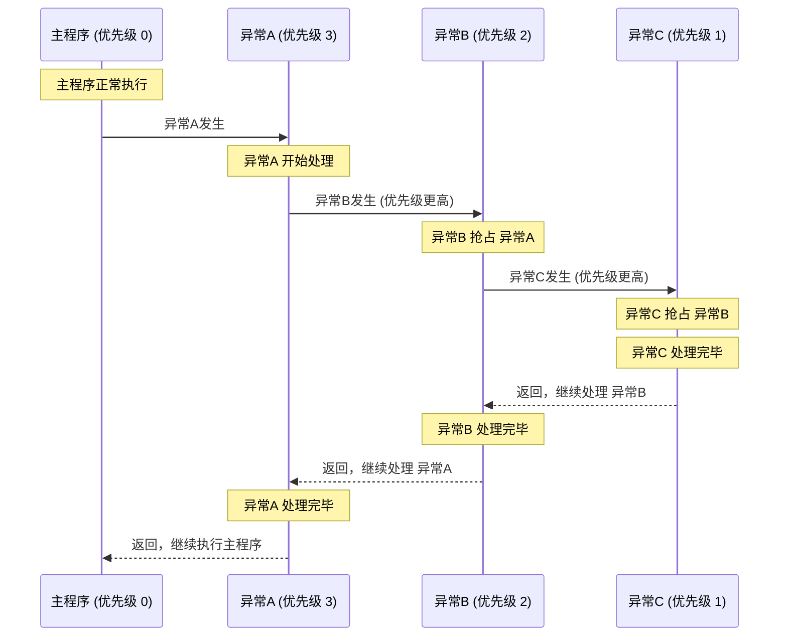

---
{"dg-publish":true,"permalink":"/技术文档/芯片/指令集架构/ARM架构/内核相关文档/设备用户指南/","dg-note-properties":{}}
---

有下述一些内容
- 寄存器相关描述
# 2 内核处理器
## 2.3 Exception model, 异常模型

**异常进入/恢复全流程**

### Exception states, 异常状态
有以下几个状态:
- `Inactive`: 这个异常没有激活并且无法挂起
- `Pending`: 这个异常等待被处理器处理.
	- 一个外设或者软件中断请求, 可以更改它对应中断的状态为挂起状态
- `Active`: 这个异常正在被处理器处理, 但还没处理完成
- `Active and pending`: 这个异常正在被处理, 并且还存在待处理的相同异常
### Exception type, 异常类型
异常的类型有:
- `Reset`: 上电或者热启动的时候被调用.
- `NMI`
- `HardFault`
- `...`
- `Interrupt`: 中断, 又叫`IRQ`, 即中断请求, 是一个外设异常信号, 或者由一个软件请求生成
### Exception handlers, 异常处理程序
处理器处理异常使用:
- `Interrupt Service Routines, ISR`: 即中断服务程序,  `ISR`可以处理的异常范围为`IRQ0-239`
- `Fault handlers`: 硬件错误, 总线错误, 用法错误, 内存管理错误都可以用这个处理程序
- `System handlers`: ...

### Vector table, 向量表
### Exception priorities, 异常优先级
### Interrupt priority grouping, 中断优先组
在中断系统中增加了一个优先级控制器, `NVIC`支持优先级组.
优先级组会划分每个中断优先级寄存器进入两个字段: 
- 一个高字段定义**组优先级**
- 一个低字段定义**组内子优先级**

只有组优先级才能决定中断异常的抢占. 当处理器正在运行一个中断异常处理程序时, 另一个有相同组优先级的中断是不会抢占该处理程序的

如果有多个一样的组优先级待处理中断, 由组内子优先级决定他们被执行的顺序, 如果待处理的中断有一样的组优先级和组内子优先级, 则根据他们的`IRQ`号决定(数字小的优先级高)先执行哪个.
### Exception entry and return, 异常进入和退出
异常处理使用以下术语来描述:

**`Preempty`**
当处理器正在运行一个异常处理程序, 如果一个异常的优先级比正在处理的异常要高, 则可以抢占处理它的异常. 可以查看[[技术文档/芯片/指令集架构/ARM架构/内核相关文档/设备用户指南#Interrupt priority grouping, 中断优先组\|#Interrupt priority grouping, 中断优先组]]来获取更多关于中断抢占的信息. 

当一个异常抢占又一个异常时, 这个异常会在异常中被嵌套调用.

**`Return`**
当异常处理完成, 并且发生下述事件, 就会`Reture`:
- 没有足够优先级的待处理异常
- 没有还需处理的异常
处理器会出栈, 并且保存发生中断之前的处理器状态, 具体的参考`Exception entry`

**`Tail-chaining`**
**`Late-arriving`**

**Exception entry**
一个异常的进入, 发生在一个未处理的足够高的优先级异常, 并且满足下述条件之一:
- 这个处理器处于线程模式
- 一个更高优先级的异常抢占原本的异常

上图说明了发生异常时, 由硬件自动触发的, 用于保护现场的堆栈信息

这个堆栈的对齐方式通常通过`CCR`寄存器的`STKALIGN-bit`控制

这个堆栈包括了`return address`, 这个地址表示被中断的程序的下一条指令的地址, 这个值会在被中断的程序恢复时加载到`PC`寄存器中

与此同时, 处理器会通过一个向量表读取异常处理函数的开始地址, 当堆栈创建初始化完成后, 处理器会开始执行异常处理函数, 并且处理器会写`EXC_RETURN`到`LR`寄存器, 这表示哪个堆栈指针对应于哪个栈帧以及它在进入异常之前的处理器所处的操作模式.

如果在进入异常处理程序时, 没有发生更高优先级的异常, 则处理器会开始运行异常处理函数, 并自动的修改待处理的中断为`active`

如果发生了更高优先级的异常, 则处理器会开始执行这个异常处理函数, 而且也不会更改之前的异常的挂起状态, 这是一个`later-arrival`的例子

**Exception return**

# 4 内核外设
## 4.2 Nested Vectored Interrupt Controller

### 使能中断寄存器
### 失能/查看中断使能寄存器, ICER
### 设置中断挂起寄存器
### 清除中断挂起寄存器
`...`

## 4.3 System control block, 系统控制块
### Vector Table Offset Register, VTOR
这个寄存器用来设置向量表从`CPU`地址空间的`0x0`开始的偏移量, 即用来重定向向量表的位置

### System Handler Control and State Register
这个寄存器用来配置使能/失能对应的错误, 以及查看使能情况
### Configurable Fault Status Register
这个寄存器可以用来指示当前发生的错误类型, 比如内存管理错误, 总线错误, 使用错误
可以用于定位程序运行时的错误

**BFSR, Bus Fault Status Register, 总线错误状态寄存器**
包含下述具体错误类型
- `[2] IMPRECISERR`
	- `1`: 表示发生了总线错误, 但是栈帧中返回的地址和发生错误的指令不符
		- 比如写缓存的清除操作导致的写失败错误

## 4.4 System timer, Systick
### 控制和状态寄存器

## 4.8 Cache maintenance operations, 缓存维护操作
包括下述三个操作
- 使能/失能一个缓存
- 无效化一个缓存
- 清除一个缓存